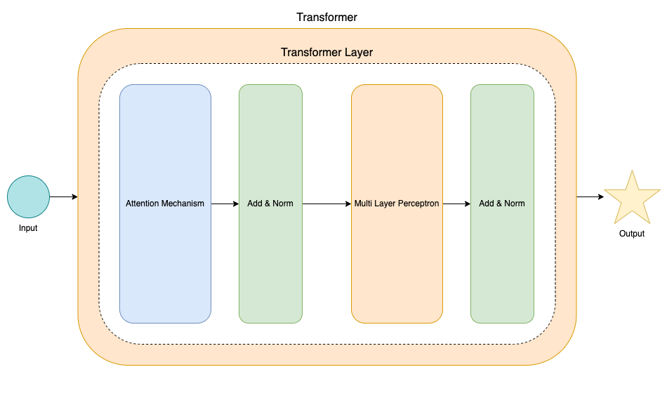
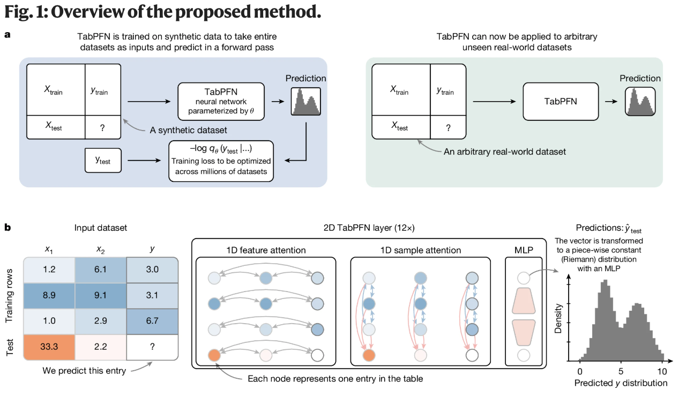
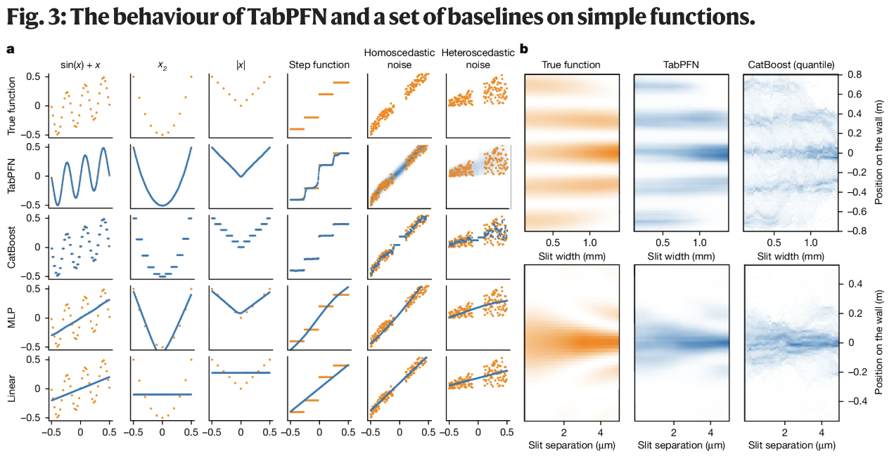
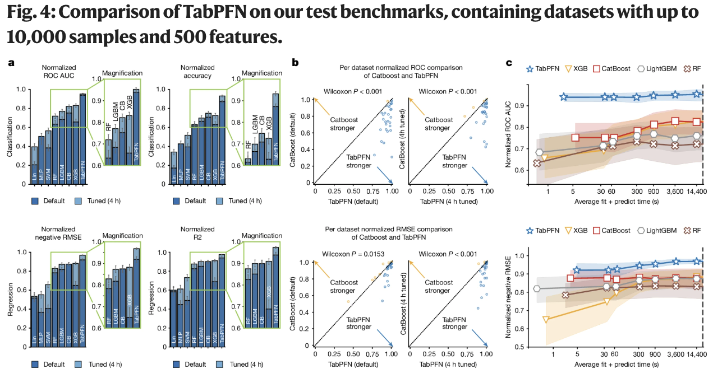

# Journal Club Session: TabPFN

## Accurate predictions on small data with a tabular foundation model

---

# Autoren

- Noah Hollmann
- Samuel Müller
- Lennart Purucker
- Arjun Krishnakumar
- Max Körfer
- Shi Bin Hoo
- Robin Tibor Schirrmeister
- Frank Hutter

---

---

---

---

